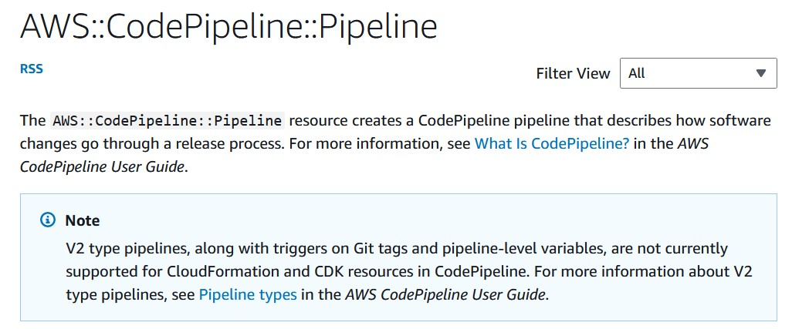

# CodePipeline V2

This CloudFormation custom resource supports the V2 type of [CodePipeline](https://docs.aws.amazon.com/AWSCloudFormation/latest/UserGuide/aws-resource-codepipeline-pipeline.html) which currently is not supported natively by CloudFormation (as per 6 November 2023).



## The Implementation

This requires an API call to AWS which is implemented in a [lambda function written in python](../../lambda-functions/codepipeline-v2/lambda_function.py). The [actual lambda function](./lambda-function.yaml) is the configured and deployed using [sceptre](https://github.com/Sceptre/sceptre), although you are free to deploy it anyway you want.
The ARN of the lambda will then be used in the [custom resource](./custom-codepipeline.yaml) as `service_token`.
This custom resource configuration will use the CloudFormation template, written in Jinja2 templating format, in [custom-code-pipeline.yaml.j2](../../templates/custom-code-pipeline.yaml.j2). The structure of this template is very similar to the [CodePipeline CloudFormation structure], with some differences:

- It supports multiple CodePipeline (hence the `pipelines` list in [custom-codepipeline.yaml](./custom-codepipeline.yaml)).
- It does not support `DisableInboundStageTransitions`.
- It does not support `RestartExecutionOnUpdate`
- It supports `PipelineType`
- It supports `Variables`, the [pipeline level variables](https://docs.aws.amazon.com/codepipeline/latest/userguide/reference-variables.html).
- It supports `Triggers`.
- You need to supply the pipeline name, unlike CloudFormation which can generate some random name for you.

## The Jinja2 template

The [provided sample template](../../templates/custom-code-pipeline.yaml.j2) is written in Jinja2 templating. It expects the variables to be passed in YAML using snake case (`this_is_snake_case`) and will produce the CloudFormation template in Pascal case (`ThisIsPascalCase`). The Pascal Case is important as the [python lambda](../../lambda-functions/codepipeline-v2/lambda_function.py) will look for those variables with specific names and they are case-sensitive.

The rendered CloudFormation template would look like this:

```YAML
Description: CodePipeline Pipeline for cfncustomresources
AWSTemplateFormatVersion: "2010-09-09"

Resources:
  SamplePipeline:
    Type: Custom::CodePipeline
    Properties:
      ArtifactStore: <either ArtifactStore or ArtifactStores is required>
        EncryptionKey: <optional>
          Id: String <required>
          Type: String <required>
        Location: String <required>
        Type: String <required>
      ArtifactStores: <either ArtifactStore or ArtifactStores is required>
        -
          ArtifactStore: <required>
            EncryptionKey: <optional>
              Id: String <required>
              Type: String <required>
            Location: String <required>
            Type: String <required>
          Region: String <required>
      Name: String <required>
      RoleArn: String <required>
      Stages: <required>
        -
          Name: String <required>
          Actions: <required>
            -
              Name: String <required>
              ActionTypeId: <required>
                Category: String <required>
                Owner: String <required>
                Provider: String <required>
                Version: String <required>
              Configuration: Json <optional>
              InputArtifacts: <optional>
                -
                  Name: String <required>
              Namespace: String <optional>
              OutputArtifacts: <optional>
                -
                  Name: String <required>
              Region: String <optional>
              RoleArn: String <optional>
              RunOrder: Integer <optional>
          Blockers: <optional, reserved for future use>
            -
              Name: String <required>
              Type: String <required>
      Tags: <optional>
        - Key: some key
          Value: some value
```

## The configuration

The configuration, if you use [the provided template](../../templates/custom-code-pipeline.yaml.j2), is very flexible. You must supply all the required variables. You need to name your variables using snake case, and you will need to meet standard CodePipeline requirements. It needs to have one source stage.
The default CodePipeline pipeline type is `V2` as oppose of the default CodePipeline type which is `V1`.

## The deployment sequence

1. Deploy the IAM role. If you use sceptre as in this code, you can immediately deploy the custom codepipeline, which will automatically deploy all the dependencies stack.
2. Deploy the lambda function. Note that the sample uses `python3.10`` runtime, which could be obsolete by the time you read this.
3. Supply the lambda function ARN to the custom codepipeline. In the given sample [custom-codepipeline.yaml](./custom-codepipeline.yaml), `SamplePipeline` is linked to the Lambda Function using the call `stack_output`. That lambda will the look for the usable variables from the rest of the resource properties.
